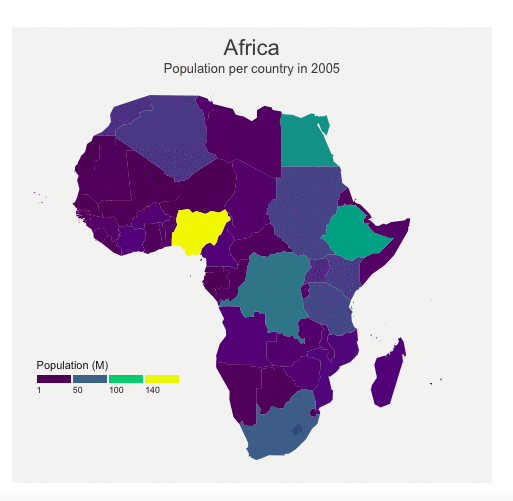
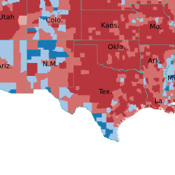
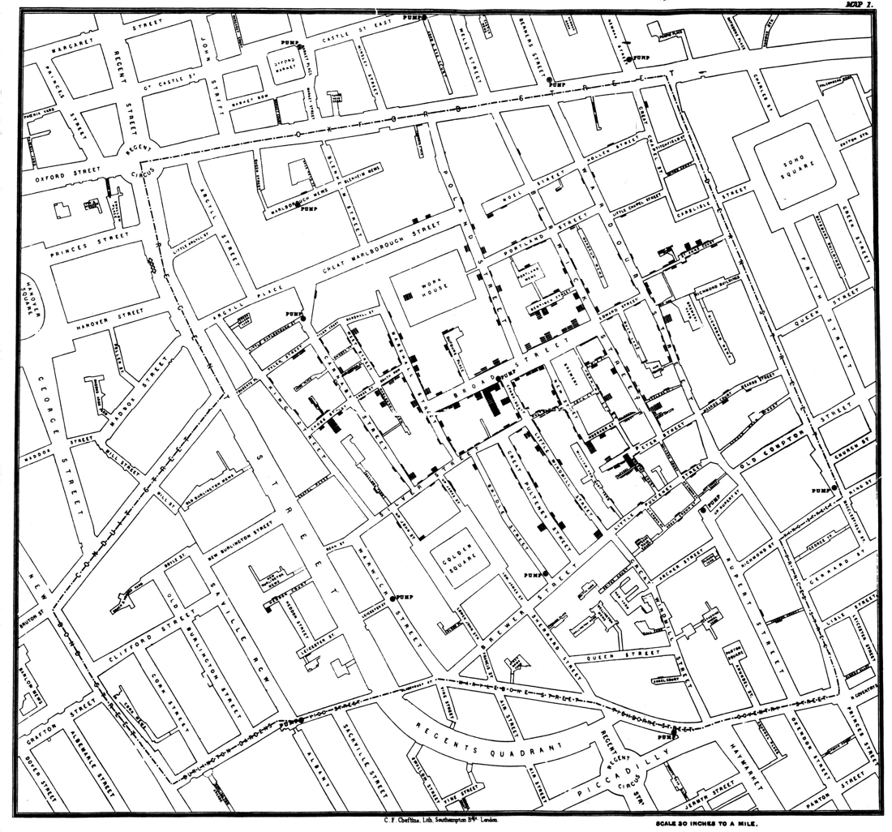
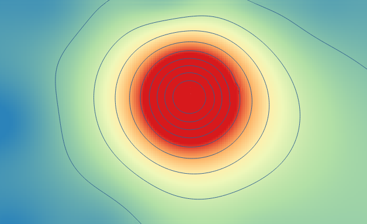
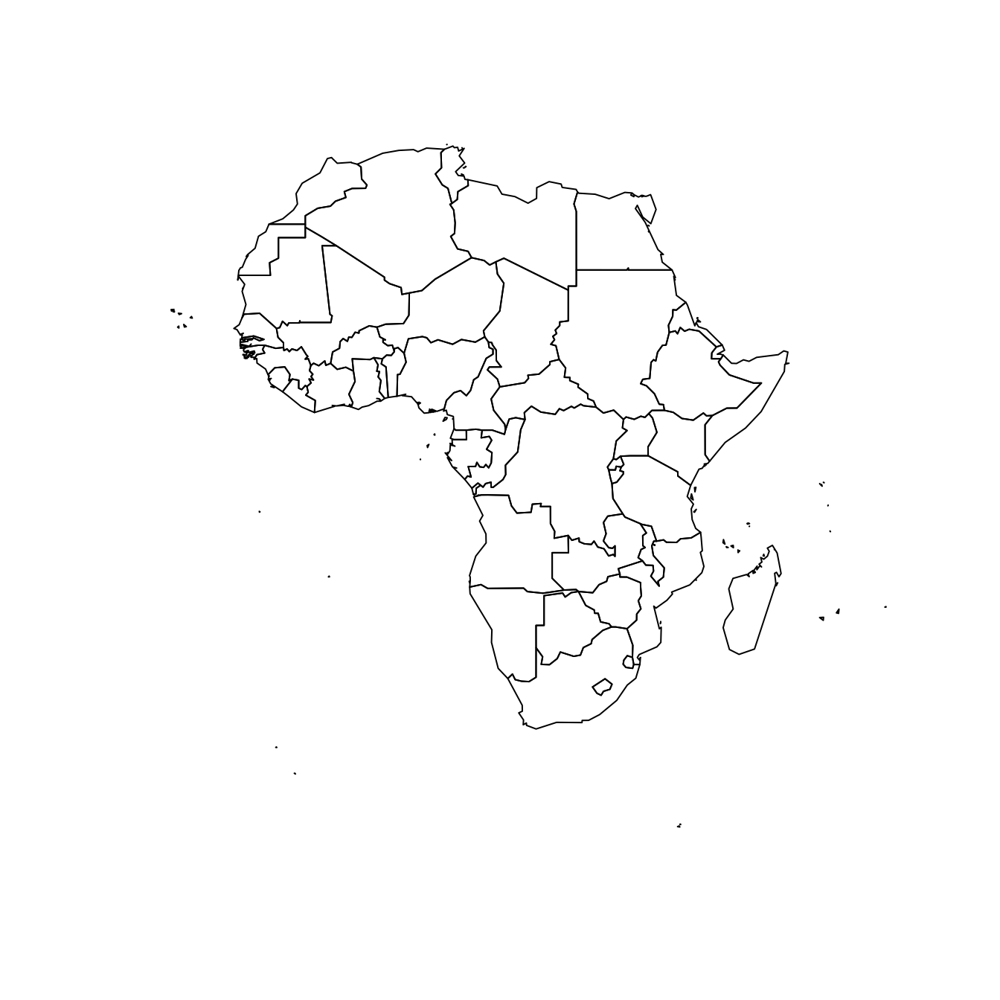
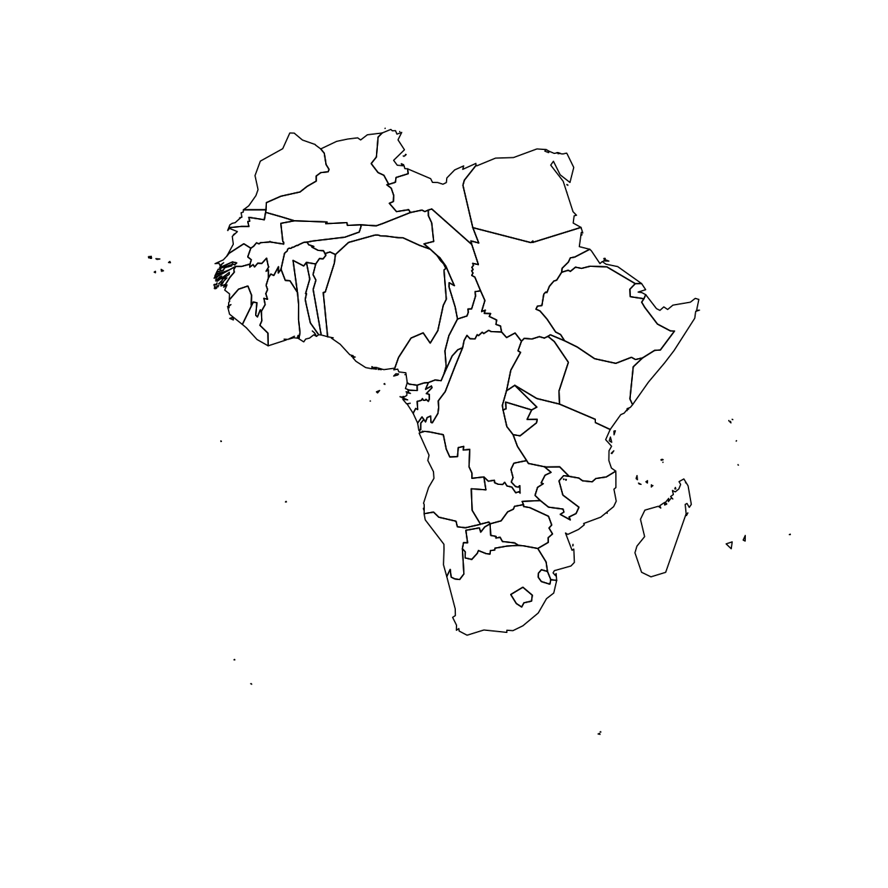
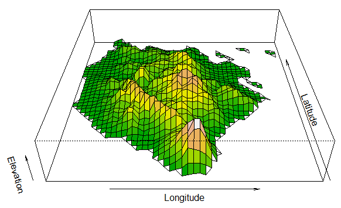

```{r setup, include=FALSE}
knitr::opts_chunk$set(echo = TRUE)
npac <- c("ggplot2","plotly" , "dplyr", "tidyr", 
        "gapminder", "ggmap", 
        "knitr", "kableExtra", "ggpubr")
for (pk in npac){
  library(pk,character.only = TRUE)
}

```


# Day 3

## Today's agenda

### Morning
- Ben: **Multivariate graphs** - Introduction
- Joe: **Multivariate graphs** - Preparing the data (dplyr, grouping, etc.).
- Arsenio: **Multivariate graphs** - Practical instruction
- All: **Multivariate graphs** - Exercises

### Afternoon
- Joe: **Mapping** - Introduction  
- Arsenio: **Mapping** - Point maps / dot density maps
- Ben: **Mapping** - Choropleth maps  
- All: **Mapping** - Exercises


# Multivariate graphs

## Multivariate graphs|Introduction (Ben)

- How do we show 3 (or more) variables on a 2 dimensional plot?

## two variable bar plot
```{r}
library(tidyverse)
library(ggthemes)

# for the afternoon, we need to install rgdal.
# install.packages('leaflet')
dat <- read.csv('data/fatal-police-shootings-data.csv')

new_dat <- dat %>% group_by(flee) %>% summarise(counts = n()) %>% filter(flee != '')
ggplot(data = new_dat, aes(x = flee, counts)) + 
  geom_bar(stat = 'identity') + labs(x = '', y = 'Counts', title = 'People killed by police') + theme_clean()

```

## The data

```{r}
summary(dat)

```

## Add 3rd variable
```{r}

new_dat <- dat %>% group_by(flee, threat_level) %>% summarise(counts = n()) %>% filter(flee != '')

ggplot(data = new_dat, aes(x = flee, y = counts, fill = threat_level)) + 
  geom_bar(stat = 'identity', position = 'dodge') + labs(x = '', y = 'Counts', title = 'People killed by police') + theme_clean()

```

## Add 3rd variable
```{r}

new_dat <- dat %>% group_by(race, threat_level) %>% summarise(counts = n()) %>% filter(race != '')

ggplot(data = new_dat, aes(x = race, y = counts, fill = threat_level)) + 
  geom_bar(stat = 'identity', position = 'dodge') + labs(x = '', y = 'Counts', title = 'People killed by police') + theme_clean()

```

## Another example
```{r}

new_dat <- dat %>% group_by(race) %>% summarise(mean_age = mean(age, na.rm = TRUE)) %>% filter(race != '')

ggplot(data = new_dat, aes(x = race, y = mean_age)) + 
  geom_bar(stat = 'identity', position = 'dodge') + labs(x = '', y = 'Avg age', title = 'People killed by police') + theme_clean()

```

## Add 3rd variable
```{r}

new_dat <- dat %>% group_by(race, threat_level) %>% summarise(mean_age = mean(age, na.rm = TRUE)) %>% filter(race != '')

ggplot(data = new_dat, aes(x = race, y = mean_age, fill = threat_level)) + 
  geom_bar(stat = 'identity', position = 'dodge') + labs(x = '', y = 'Avg age', title = 'People killed by police') + theme_clean()

```

## More examples

- Life expectancy and gdp per capita in 2007

```{r}
dat <- gapminder
dat <- dat %>% filter(year == '2007')
ggplot(data = dat, aes(gdpPercap, lifeExp)) + 
  geom_point(size = 2, alpha = 0.4) +
  labs(x = 'GDP per capita', 
       y = 'Life expectancy',
       title = 'GDP per capita and Life expectancy') + theme_clean()

```

## Numeric data (3 variables)

- Life expectancy and gdp per capita in 2007
- The size of the points represents population

```{r}
options(scipen = '999')
dat <- gapminder
dat <- dat %>% filter(year == '2007')
ggplot(data = dat, aes(gdpPercap, lifeExp)) + 
  geom_point(aes(size = pop), alpha = 0.4) +
  labs(x = 'GDP per capita', 
       y = 'Life expectancy',
       title = 'GDP per capita and Life expectancy') + theme_clean()
```

## Numeric data (4 variables)

- Life expectancy and gdp per capita in 2007
- The size of the points represents population

```{r}
options(scipen = '999')
dat <- gapminder
dat <- dat %>% filter(year == '2007')
ggplot(data = dat, aes(gdpPercap, lifeExp)) + 
  geom_point(aes(size = pop, color = continent), alpha = 0.4) +
  labs(x = 'GDP per capita', 
       y = 'Life expectancy',
       title = 'GDP per capita and Life expectancy') + theme_clean()
```

## Another example

```{r}
options(scipen = '999')
dat <- gapminder
dat <- dat %>% group_by(year, continent) %>% summarise(avg_gdp = mean(gdpPercap),
                                                       avg_life_exp = mean(lifeExp),
                                                       avg_pop = mean(pop))
# dat <- dat %>% filter(continent == 'Oceania')
ggplot(data = dat, aes(year, avg_pop)) +
  geom_point(aes(color = continent)) +
  geom_line(aes(color = continent)) +
  labs(x = 'Year', 
       y = 'Population',
       title = 'Year and population by continent') + theme_clean()
```

## Another example

```{r}
options(scipen = '999')
dat <- gapminder
dat <- dat %>% group_by(year, continent) %>% summarise(avg_gdp = mean(gdpPercap),
                                                       avg_life_exp = mean(lifeExp),
                                                       avg_pop = mean(pop))
# dat <- dat %>% filter(continent == 'Oceania')
ggplot(data = dat, aes(year, avg_pop)) +
  geom_point(aes(color = continent, size = avg_gdp)) +
  geom_line(aes(color = continent)) +
  labs(x = 'Year', 
       y = 'Population',
       title = 'Year and population by continent') + theme_clean()
```

## Another example

```{r}
options(scipen = '999')
dat <- gapminder
dat <- dat %>% group_by(year, continent) %>% summarise(avg_gdp = mean(gdpPercap),
                                                       avg_life_exp = mean(lifeExp),
                                                       avg_pop = mean(pop))
# dat <- dat %>% filter(continent == 'Oceania')
ggplot(data = dat, aes(year, avg_pop)) +
  geom_point(aes(color = continent, size = avg_life_exp)) +
  geom_line(aes(color = continent)) +
  labs(x = 'Year', 
       y = 'Population',
       title = 'Year and population by continent') + theme_clean()
```

## Asia example
```{r}
options(scipen = '999')
dat <- gapminder
dat <- dat %>% group_by(year, country) %>% filter(continent == 'Asia' & country %in% c('China', 'Japan', 'Singapore', 'Korea, Rep.')) %>% summarise(gdp = mean(gdpPercap),
                                                       life_exp = mean(lifeExp),
                                                       pop = mean(pop))
# dat <- dat %>% filter(continent == 'Oceania')
ggplot(data = dat, aes(year, gdp)) +
  geom_point(aes(color = country, size = pop)) +
  geom_line(aes(color = country)) +
  labs(x = 'Year', 
       y = 'GDP per capita',
       title = 'Year and GDP') + theme_clean()

```

# Multivariate graphs (Arsenio)


## Multivariate graphs|Data preparation (Joe)

(Practice exercises)

## Multivariate graphs|Practical instruction (Arsenio)

www.databrew.cc/exercises3

# Afternoon

# Maps

## Maps|Introduction (Joe)

- What is a map?  
- What is longitude and latitude?  
- What kind of maps are there?  

## What is a map?

- A _symoblic_ representation of a place.

## What is longitude and latitude?  

- Longitude: the angular distance of a place east or west of the Greenwich meridian
- Latitude: 
the angular distance of a place north or south of the earth's equator

```{r, echo = FALSE, include = FALSE}
library(maps)
```

```{r}
map('world')
abline(h = 0, col = 'red')
abline(v = 0, col = 'blue')
```

## What kind of maps are there?

Choropleth

<center>

</center>

## What kind of maps are there?

Choropleth

<center>

</center>


## What kind of maps are there?

Point

<center>

</center>

## What kind of maps are there?

Point density

<center>

</center>


## What kind of maps are there?

Point density

<center>

</center>


## What kind of maps are there?

Point density

<center>

</center>


## What kind of maps are there?

Administrative

<center>

</center>


## What kind of maps are there?

Population cartogram

<center>

</center>

## What kind of maps are there?

Elevation maps


<center>

</center>


## Maps|Dot density maps (Arsenio)

* Use points on a map to explore spatial relationships
* The geographic coordinates (longitude and latitude) are usually required for each observation
* E.g.: Suppose we have located moquitoes' habitats in Manhica district, and recorded their geographic coordinates and the number of anophel larvae
  + Let's plot the  locations of the habitats on the map

```{r, message=FALSE, warning=FALSE}
library(leaflet)
mosquito <- rio::import("data/mosquito_habitat.rds") # Note: This are fake data
# Print the variable names
names(mosquito)
```

## Maps|Dot density maps

```{r}
mosquito[4:6,]
```


* Plot mosquitoes' habitat on the map using circles markers

```{r, eval=FALSE}
library(leaflet)
leaflet(mosquito, width = 1000, height = 600) %>%
  addTiles() %>%  # Add default OpenStreetMap map tiles
  addCircleMarkers(lng = ~longitude, lat = ~latitude)
```


***

```{r, echo=FALSE, message=FALSE, warning=FALSE}
library(leaflet)
leaflet(mosquito, width = 1000, height = 600) %>%
  addTiles() %>%  # Add default OpenStreetMap map tiles
  addCircleMarkers(lng = ~longitude, lat = ~latitude)
```


## Maps|Dot density maps -- enhancements

```{r, eval=FALSE}
leaflet(mosquito, width = 1000, height = 600) %>%
  addTiles() %>%  
  addCircleMarkers(lng = ~longitude,lat = ~latitude,
                   color = ~ifelse(anophel_larvae>0,'red','green'),
                   popup = ~paste0('Habitat: ', habitat_id,
                          ', Number of anophel larvae: ', anophel_larvae),
                   label = ~habitat_id,
                   radius = 7,stroke = F,fillOpacity = 0.5)

```


***

```{r, echo=FALSE}
leaflet(mosquito, width = 1000, height = 600) %>%
  addTiles() %>%  
  addCircleMarkers(lng = ~longitude,lat = ~latitude,
                   color = ~ifelse(anophel_larvae>0,'red','green'),
                   popup = ~paste0('Habitat: ', habitat_id,
                          ', Number of anophel larvae: ', anophel_larvae),
                   label = ~habitat_id,
                   radius = 7,stroke = F,fillOpacity = 0.5)

```


## Maps|Choropleth maps (Ben)

- A choropleth map displays divided geographical areas or regions that are coloured in relation to a numeric variable. 

```{r}
data(quakes)
dat <- quakes
# Show first 20 rows from the `quakes` dataset
leaflet(data = dat) %>% addTiles() %>%
  addMarkers(~long, ~lat, popup = ~as.character(mag), label = ~as.character(mag))
```

## Maps|Exercises (all)
