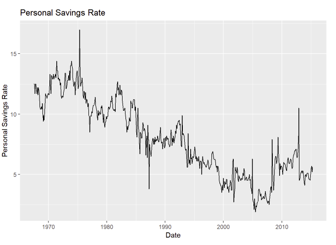
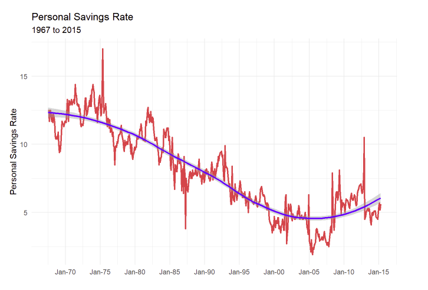
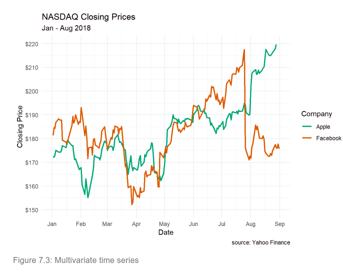
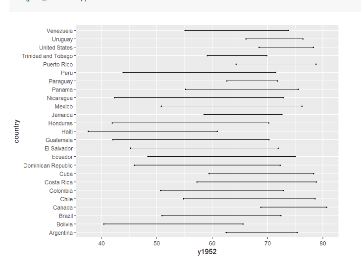
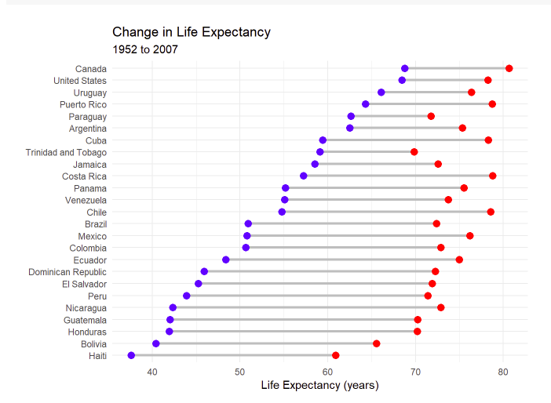
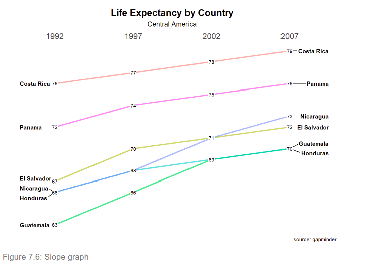
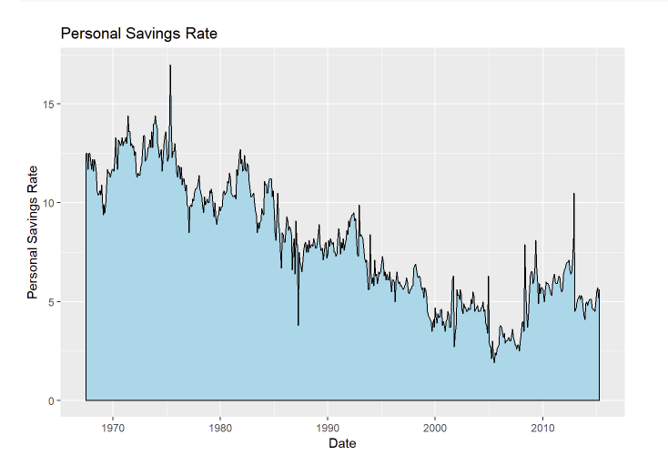
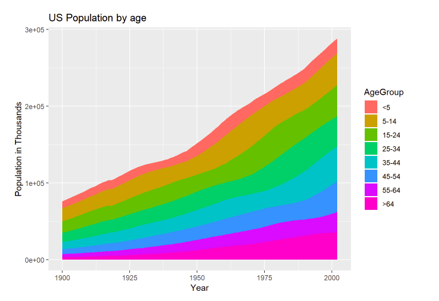
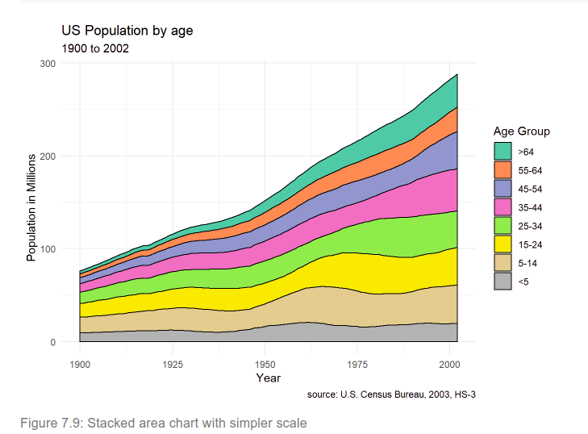

```{r setup, include=FALSE}
knitr::opts_chunk$set(echo = TRUE)
npac <- c("ggplot2","plotly" , "dplyr", "tidyr", 
        "gapminder", "ggmap", 
        "knitr", "kableExtra", "ggpubr")
for (pk in npac){
  library(pk,character.only = TRUE)
}

```


# Day 4

## Today's agenda


### Morning

- Ben: **Time-dependent charts** - Introduction
- Joe: **Time-dependent charts** - Time series
- Arsenio: **Time-dependent charts** - Dumbbell, slope, area charts
- All: **Time-dependent charts** - Exercises

### Afternoon

- Arsenio: **Statistical models** - Introduction
- Ben: **Statistical models** - Correlation plots
- Arsenio: **Statistical models** - Linear regression 
- Joe: **Statistical models** - Logistic regression
- Ben: **Statistical models** - Mosaic plots
- Ben: **Statistical models** - Survival plots
- All: **Statistical models** - Exercises

## Time dependent charts - scatter plot





## Time series analysis



## More than two variables


## Dummbbell charts (two time points)


## Dummbbell charts (two time points)


## Slope graphs 



## Area graphs




## Area graphs 3 variables



## Area graphs

- scale_fill_brewer(palette = "Set2") +
- theme_minimal()



