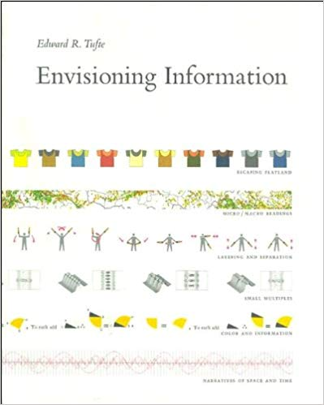
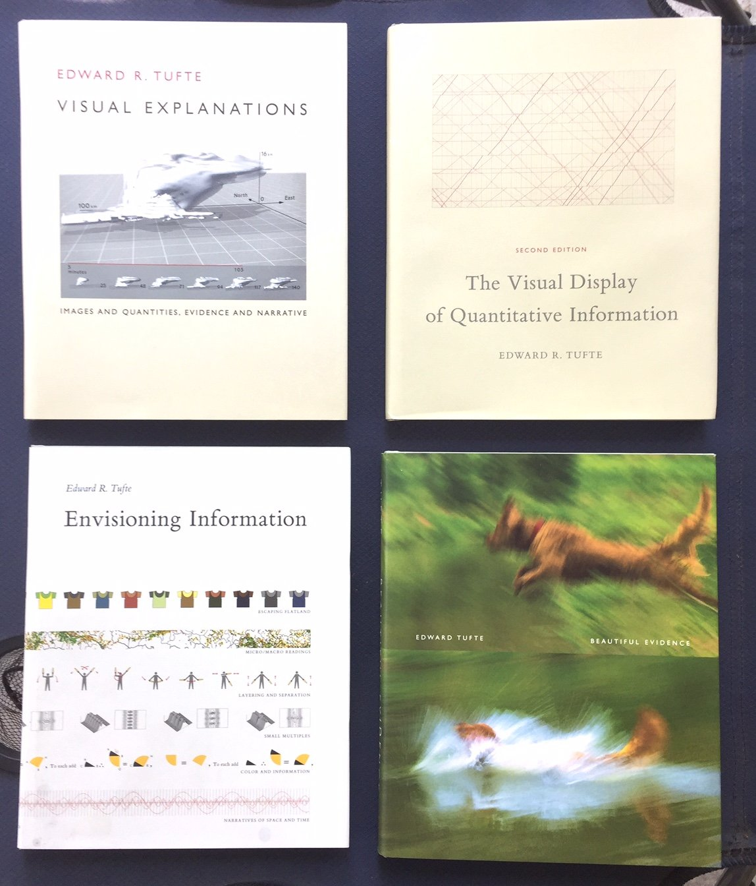
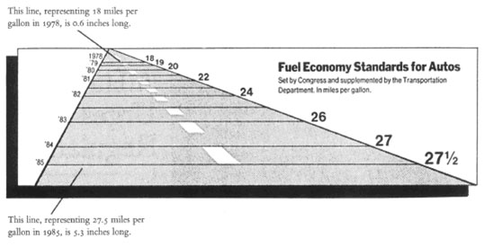
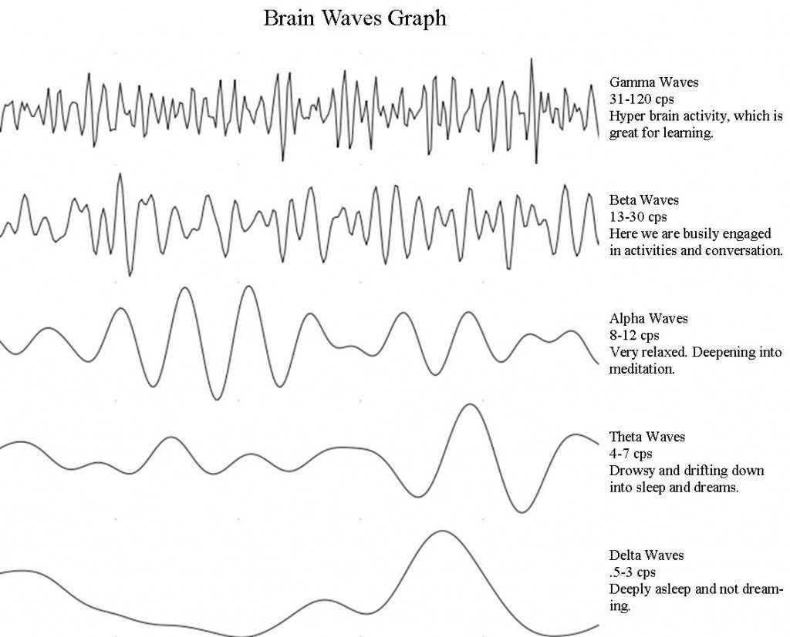
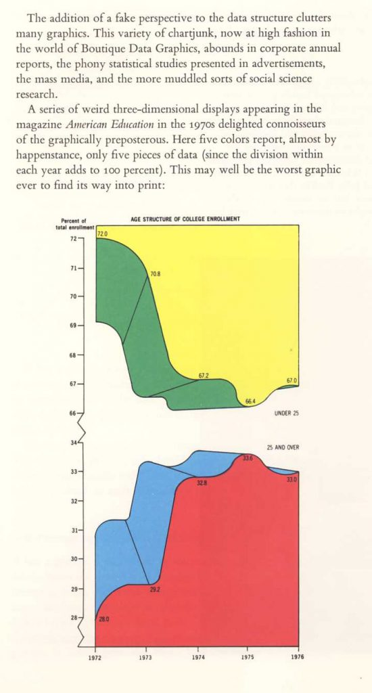
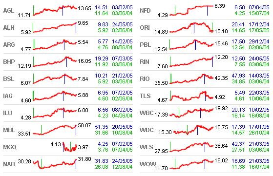
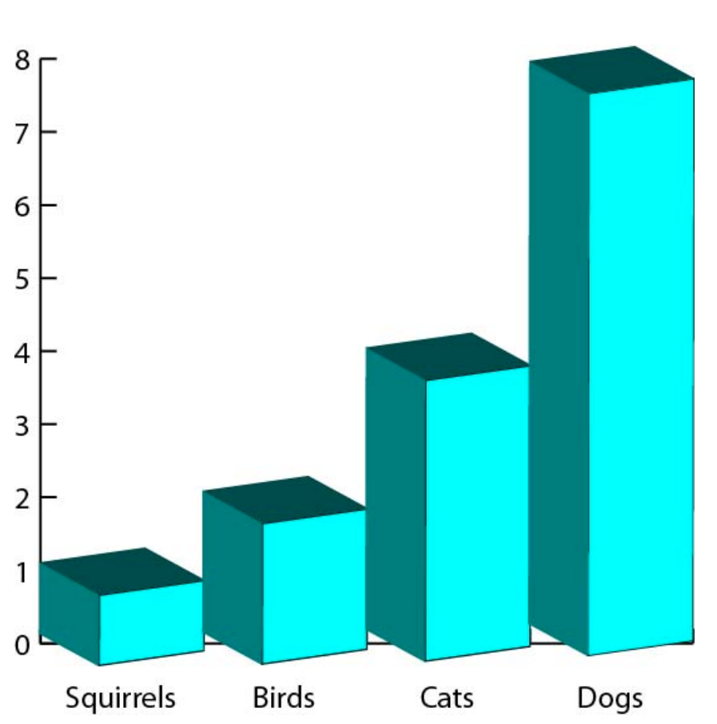
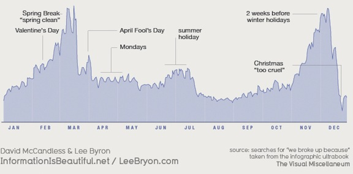
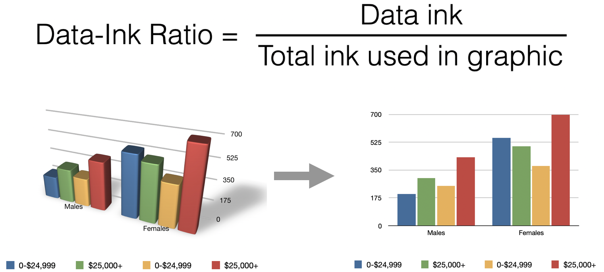

```{r setup, include=FALSE}
knitr::opts_chunk$set(echo = TRUE)
npac <- c("ggplot2","plotly" , "dplyr", "tidyr", 
        "tidyverse", "ggthemes",
        "gapminder", "ggmap", 
        "knitr", "kableExtra", "ggpubr")
for (pk in npac){
  library(pk,character.only = TRUE)
}

```

# Day 5

## Edward Tufte


## Edward Tufte




## Edward Tufte


```{r, out.width = "400px", echo = FALSE}

```

## Putting a language to visualization: layers

```{r, out.width = "400px", echo = FALSE}
knitr::include_graphics("www/tufte4.png")
```

## Tufte's principles

### 1. Graphical integrity

The size of elements should be directly proportional to the values they represent


```{r, echo = FALSE}
df <- data.frame(company = c('My company', 'Their company'),
                 label = c(94, 87),
                 value = c(90, 45))

ggplot() +
  geom_bar(data = df,
       aes(x = company,
           y = value),
       stat = 'identity') +
  theme_fivethirtyeight() +
  geom_label(data = df, aes(x = company, y = value, label = label),
             nudge_y = -10, size = 10) +
  theme(axis.text.y = element_blank(),
        axis.text.x = element_text(size = 14))
```


## Tufte's principles

### 1. Graphical integrity

The size of elements should be directly proportional to the values they represent

```{r, echo = FALSE}
df <- data.frame(company = c('My company', 'Their company'),
                 label = c(94, 87),
                 value = c(90, 45))

ggplot() +
  geom_bar(data = df,
       aes(x = company,
           y = label),
       stat = 'identity') +
  theme_fivethirtyeight() +
  geom_label(data = df, aes(x = company, y = label, label = label),
             nudge_y = -10, size = 10) +
  theme(axis.text.y = element_blank(),
        axis.text.x = element_text(size = 14))
```

## Tufte's principles

### 2. Labelling

Label axes, elements, titles, etc. Make it clear. Don't let anything be ambiguous.


```{r, include = FALSE, echo = FALSE}
library(tidyverse)
weather <- read_csv("https://github.com/databrew/maputo/blob/master/day3/data/mozambican_weather.csv?raw=true")
```


```{r, echo = FALSE}
pd <- weather %>% filter(district == 'BILENE', date >= '2012-01-01')
ggplot(data = pd,
       aes(x = date,
           y = temp_max)) +
  geom_point() +
  labs(x = 'Time',
       y = 'Malaria',
       title = 'Malaria in Manhiça')
```

## Tufte's principles

### 2. Labelling


```{r, echo = FALSE}
pd <- weather %>% filter(district == 'BILENE', date >= '2012-01-01')
ggplot(data = pd,
       aes(x = date,
           y = temp_max)) +
  geom_point(alpha = 0.7) +
  labs(x = 'Day',
       y = 'Cases',
       title = 'Clinical cases of adult Malaria in Manhiça',
       subtitle = 'According to the BES',
       caption = 'Data property of ABC. Only share with permission of XYZ.') 
```

## Tufte's principles

### 2. Labelling

```{r, echo = FALSE}
pd <- weather %>% filter(district == 'BILENE', date >= '2012-01-01')
ggplot(data = pd,
       aes(x = date,
           y = temp_max)) +
  geom_point(alpha = 0.7) +
  labs(x = 'Day',
       y = 'Cases',
       title = 'Clinical cases of adult Malaria in Manhiça',
              subtitle = 'According to the BES',
       caption = 'Data property of ABC. Only share with permission of XYZ.') +
  geom_label(data = data.frame(date = as.Date('2015-04-01'),
                                   temp_max = 15,
                                   label = 'Records lost in fire'),
             aes(x = date,
                 y = temp_max,
                 label = label))
```

## Tufte's principles

### 3. Show data variation, not design variation


```{r, out.width = "400px", echo = FALSE}

```

## Tufte's principles


### 4. With large numbers (money, etc.), scale and standardize.

```{r, echo = FALSE}
dates <- seq(as.Date('2019-01-01'), as.Date('2019-12-31'), by = 1)
df <- data.frame(date = dates,
                 value = rnorm(mean = 102931092, sd = 1000000, n = length(dates)))
ggplot(data = df,
       aes(x = date,
           y = value)) +
  geom_line() +
  labs(x = 'Day',
       y = 'MZN',
       title = 'Mozambican meticais over time') +
  geom_smooth()
```

## Tufte's principles

### 4. With large numbers (money, etc.), scale and standardize.

```{r, echo = FALSE}
dates <- seq(as.Date('2019-01-01'), as.Date('2019-12-31'), by = 1)
df <- data.frame(date = dates,
                 value = rnorm(mean = 102931092, sd = 1000000, n = length(dates)))
ggplot(data = df,
       aes(x = date,
           y = value / 1000000)) +
  geom_line() +
  labs(x = 'Day',
       y = 'MZN (Millions)',
       title = 'Mozambican meticais over time') +
  geom_smooth()
```


## Tufte's principles

### 5. Focus on the data to ink ratio.

```{r, out.width = "400px", echo = FALSE}

```


## Tufte's principles

### 5. Focus on the data to ink ratio.

```{r, out.width = "400px", echo = FALSE}

```


## Tufte's principles

### 5. Focus on the data to ink ratio.

```{r, out.width = "400px", echo = FALSE}

```


## Tufte's principles

### 5. Focus on the data to ink ratio.

```{r, out.width = "400px", echo = FALSE}

```


## Tufte's principles

### 5. Focus on the data to ink ratio.

```{r, out.width = "400px", echo = FALSE}

```


## Tufte's principles

### 5. Focus on the data to ink ratio.

```{r, out.width = "400px", echo = FALSE}

```

## Hans Rosling (1)

<iframe width="640" height="360" src="https://www.youtube.com/embed/jbkSRLYSojo" frameborder="0" allow="accelerometer; autoplay; encrypted-media; gyroscope; picture-in-picture" allowfullscreen></iframe>

## Hans Rosling (2)

<iframe width="480" height="360" src="https://www.youtube.com/embed/hVimVzgtD6w" frameborder="0" allow="accelerometer; autoplay; encrypted-media; gyroscope; picture-in-picture" allowfullscreen></iframe>

## RMarkdown

