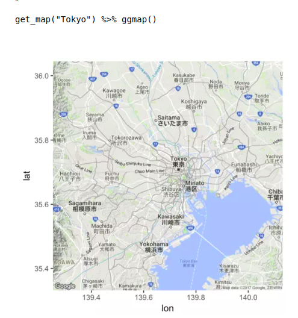

# Day 1


```{r, echo = FALSE, eval = TRUE, results = 'hide', include = FALSE}
library(tidyverse)
library(tidyr)
```


## Plan for the day
### Morning  
- Arsenio: Introduction and week plan  
- Ben: What is R? Why use R?
- Joe: The learning curve and motivation
- Arsenio: **Preparing the environment**

### Afternoon
- Arsenio: **Preparing the data** (basic only, save databases, etc. for day 5) 
- Ben: **Introduction to ggplot2** (context, rationale, structure)
- Joe: First chart

## Introduction and week plan (Arsenio)

- Main goals for the course
- Main goals for each day

## What is R? (Ben)

- Why use it?
  - Intuitive, powerful, and popular.
  - Open source: it's free and maintained and upadated by programmers all over the world.
 
<center>

</center>

## What is R? (Ben)

- Object oriented programming language
  -Designed to make data handling and statitics intuitive.
 
- Why use it?
  - Intuitive, powerful, and popular.
  - Open source: it's free and maintained and upadated by programmers all over the world.
 
## There is a package for that!
<center>

</center?

## There is a package for that!

<center>

</center>
 
## There is a package for that!
<center>
  
</center>

## There is a package for that!

<center>

</center>
 
## There is a package for that!

<center>

</center>

## There is a package for that!

<center>

</center>

## There is a package for that!

<center>

</center>

## There is a package for that!

<center>

</center>

## There is a package for that!

<center>

</center>

## There is a package for that!

<center>

</center>


## R is fast


## R is beautiful

<center>

</center>


## R is beautiful

<center>

</center>


## R is beautiful
<center>

</center>

## R is beautiful
<center>

</center>


## R is beautiful
<center>

</center>


## The learning curve (Joe)

```{r}
time <- 1:100
spss <- 1:100
sas <- ((1:100)^(2)) / 90
stata <- ((1:100)^(2.1)) / 100
excel <- ((1:100) ^ (0.2)) * 30
r <- ((1:100)^(2.3)) / 100
r[1:40] <- r[1:40] * seq(0, 1, length = 40)
pd <- tibble(time, excel, spss, sas, stata, r) %>%
  gather(key, value, excel:r) %>% 
  mutate(key = toupper(key))

variations <- list(
  c('EXCEL'),
  c('EXCEL', 'SPSS'),
  c('EXCEL', 'SPSS', 'SAS'),
  c('EXCEL', 'SPSS', 'SAS', 'STATA'),
  c('EXCEL', 'SPSS', 'SAS', 'STATA', 'R')
)
var_plot <- function(i){
  this_variation <- variations[[i]]
  pdx <- pd %>% filter(key %in% this_variation)
  ggplot(data = pdx,
       aes(x = time,
           y = value)) +
  geom_line(aes(color = key)) +
    scale_color_discrete(name = '') +
    labs(x = 'Time',
         y = 'Value of concepts learned')
}
var_plot(1)
```

## The learning curve (Joe)

```{r}
var_plot(2)
```

## The learning curve (Joe)

```{r}
var_plot(3)
```


## The learning curve (Joe)

```{r}
var_plot(4)
```


## The learning curve (Joe)

```{r}
var_plot(5) + xlim(1, 10) + ylim (0, 50)
```

## The learning curve (Joe)

```{r}
var_plot(5) 
```


## Preparing the environment (Arsenio)
- Installing R
- Installing RStudio
- Understanding the interface / the 4 panels
  - The scripts.
  - The console.
  - The global environment.
  - The plots.

## Preparing the environment|Installing R and RStudio

For this training, we will use:

1. **R** -- a free software environment for statistical computing and graphics (download and install from https://cloud.r-project.org/)
2. **RStudio** -- an integrated development environment for R (download and install from https://rstudio.com/products/rstudio/download/)
3. **Packages** -- extend the capabilities of R. To install a package, open RStudio then
   + Packages --> Install --> *type the package name in Packages* --> Install or
   + Type `install.packages("package_name")` then hit Enter key
     - e.g.: install.packages("plotly")

  
# Packages (Arsenio)
  
## Preparing the environment|Installing the necessary packages

Run the following code to install all the necessary packages

```{r, eval=FALSE}
npac <- c("ggplot2","plotly" , "dplyr", "tidyr", "mosaicData", "carData", "rio", "VIM", 
        "scales", "treemapify", "gapminder", "ggmap", "choroplethr", "choroplethrMaps", 
        "CGPfunctions", "ggcorrplot", "visreg", "gcookbook", "forcats", "survival", 
        "survminer", "ggalluvial", "ggridges", "GGally", "superheat", "waterfalls", 
        "factoextra", "networkD3", "ggthemes", "hrbrthemes", "ggpol", "ggbeeswarm",
        "knitr", "kableExtra", "ggmosaic", "sjPlot", "vcd", "ggpubr")

install.packages(npac)
```

## How to use/load a package (Arsenio)

Use a function without loading its package:

* `package_name::function_name()`
```{r, eval = FALSE}
ggplot2::ggplot()
dplyr::mutate()
```

Load a package so that all ist function are readily avaible

* `library(package_name)`
```{r, eval = FALSE}
library(ggplot2)
library(dplyr) 
```


## How to use/load a package (Arsenio) 

Use a function after loading its package:

* `function_name()`
```{r, eval = FALSE}
ggplot()
mutate()
```

R loads automatically a set of packages necessary for its basic functionality

# Afternoon


# Afternoon

## Preparing the data (Arsenio)

 - Exploring packages and functions to read in data.
 - Preparing the data for analysis and visualization.

## Introduction to ggplot2 (Ben)

- The advantages of ggplot.
- Quick, simple, and beautiful.
- Exploring the basics as well as showing the potential.

## The advantages

<center>

</center>

## The advantages

- Its part of a pipeline of well maintained packages.
- Tidyverse = readr -> dplyr -> ggplot2

## Quck and simple
<center>

</center>

## Quck and simple
<center>

</center>


## Quck and simple
<center>

</center>

## the potential
<center>

</center>

## the potential
<center>

</center>


## the potential
<center>

</center>

## the potential
<center>

</center>

## the potential
<center>

</center>

## the potential
<center>

</center>

## the potential
<center>

</center>


## First chart (Joe)

```{r}
library(gapminder)
```


## First chart (Joe)

```{r}
library(gapminder)
gm <- gapminder::gapminder
head(gm)
```


## First chart (Joe)

```{r}
library(gapminder)
gm <- gapminder::gapminder

ggplot(data = gm)
```

## First chart (Joe)

```{r}
library(gapminder)
gm <- gapminder::gapminder

ggplot(data = gm,
       aes(x = gdpPercap,
           y = lifeExp))
```

## First chart (Joe)

```{r}
library(gapminder)
gm <- gapminder::gapminder

ggplot(data = gm,
       aes(x = gdpPercap,
           y = lifeExp)) +
  geom_point()
```


# Preparing the data

## Preparing the data|Importing data from files (Arsenio)

Set the working directory (`setwd('path_to_a_folder')`)

* It's a folder in your computer where `R` search for and save files by default

Example:


```{r, eval=FALSE}
# Read the file clinic_v1.xlsx from C:\Users\qnhacolo\Documents\DataVisMz\data
# (note the path notation difference between Windows (\) and R (/))
library(readxl)
cv1 <- read_excel("C:/Users/qnhacolo/Documents/DataVisMz/data/clinic_v1.xlsx", sheet=1)

# After setting the working directory
setwd("C:/Users/qnhacolo/Documents/DataVisMz/data/")
library(readxl)
cv1 <- read_excel("clinic_v1.xlsx", sheet=1)
```

## Preparing the data|Importing data from files (Arsenio)

Different packages/functions to import data from different file formats

<div style="float: left; width: 50%;">
```{r, eval=FALSE}
library(readr)
# from a comma delimited file
cv1 <- read_csv("cv1.csv")
# from a tab delimited file
cv1 <- read_tsv("cv1.txt")

library(readxl)
# from an Excel workbook
cv1 <- read_excel("cv1.xlsx", sheet=1)
```
</div>


<div style="float: right; width: 50%;">
```{r, eval=FALSE}
library(haven)
# from Stata file
cv1 <- read_dta("cv1.dta")
# from SPSS file
cv1 <- read_sav("cv1.sav")
# from SAS file
cv1 <- read_sas("cv1.sas7bdat")
```
</div>

## Preparing the data|Importing data from files (Arsenio)

Swiss-army knife for data import/export: `rio`
```{r, eval=FALSE}
library(rio)
# from any (supported) file format
cv1 <- import("cv1.csv")
cv1 <- import("cv1.txt")
cv1 <- import("cv1.xlsx")
cv1 <- import("cv1.dta")
cv1 <- import("cv1.sav")
cv1 <- import("cv1.sas7bdat")
```


## Preparing the data|Example study

Suppose we have three datasets from a study:

* `recruitment.xlsx` -- data collected during the participant recruitment
* `clinic_visit1.xlsx` -- data from the first clinic visit
* `clinic_visit2.xlsx` -- data from the second clinic visit, has the same variables as `clinic_visit1.xlsx`

```{r, eval=FALSE}
ddir <- "C:/Users/qnhacolo/.../DataVis/GitHub/maputo-master/slides/"
setwd(ddir)
# Import (read) the data
rec <- rio::import("data/recruitment.xlsx")
cv1 <- rio::import("data/clinic_visit1.xlsx")
cv2 <- rio::import("data/clinic_visit2.xlsx")
```

```{r, echo=FALSE}
#ddir <- "C:/Users/qnhacolo/Google Drive/CISM/Trainning/Trainer/TESA/DataVis/GitHub/maputo-master/slides/"
#setwd(ddir)
# Import (read) the data
rec <- rio::import("data/recruitment.xlsx")
cv1 <- rio::import("data/clinic_visit1.xlsx")
cv2 <- rio::import("data/clinic_visit2.xlsx")
```

***

```{r, eval=FALSE}
rec[1:2,]
```

```{r, eval=FALSE}
cv1[1:2,]
```

```{r, eval=FALSE}
cv2[1:2,]
```

## Preparing the data|Creating new variables

* Create age at recruitment in days (`age_d`) and in years (`age_y`) variables in the `rec`data frame

```{r, eval=FALSE}
rec$age_d <- difftime(rec$date_recru, rec$date_birth, units = "days")
rec$age_d <- as.integer(rec$age_d) # convert to integer class
rec$age_y <- rec$age_d/365.25
# Round to the nearest integer
rec$age_y <- round(rec$age_y, digits = 0)
```

* Check the tidyverse's `lubridate` package for more advanced date/time manipulation

## Preparing the data|Joining data frames vertically (appending)

* `cv1` and `cv2` have the same variables (columns), let's combine them vertically

```{r, eval=FALSE}
# In order to be able to identity the visit in the combined
# data frame, we need to create extra variable before
cv1$visit <- "v1"
cv2$visit <- "v2"
# Now combining
cvs <- rbind(cv1, cv2)
```

## Preparing the data|Reshaping data

* The `cvs` data frame has data from different visits of the same study participant in different rows -- this is called __long format__
* We would like to have the data from all visits of the same participant in the same row -- this is called __wide format__

```{r, eval=FALSE}
library(tidyr)
# Reshaping from long to wide
cvs_wide <- pivot_wider(cvs,
                        id_cols = "subjectid",
                        names_from = "visit",
                        values_from = c("date", "weight_kg", "temp", "mal_test"))
```

* Use `pivot_longer()` to reshape from wide to long format

## Preparing the data|Joining data frames horizontally (merging)

* Now that we have all visits' data in one row per participant, we would like to joint them with the corresponding participant data from the recruitment (`rec`)

```{r, eval=FALSE}
rcv <- merge(rec, cvs_wide, by = "subjectid", all.x = TRUE, all.y = TRUE)
```

## Preparing the data|Recode categorical variables

* The variable `sex` is stored as numeric (1 and 2), where _1=Female_ and _2=Male_
* `marital_status` is stored as _sing_ (Single), _marr_ (Married), _divo_ (Divorced) and _wido_ (Widowed)

```{r, eval=FALSE}
# Recoding variables
rcv$sex <- factor(rcv$sex,
                          levels = c(1, 2),
                          labels = c("Female", "Male"))

rcv$marital_status <- factor(rcv$marital_status,
                                     c("sing", "marr", "divo", "wido"),
                                     c("Single", "Married", "Divorced", "Widowed"))
```

## Preparing the data|Subsetting data -- rows (observations)

* `dataframe_name[row_selection,]`
* `row_selection` can be a
  + vector of row numbers
    - `rcv[2,]` returns the 2^nd^ row
    - `rcv[c(1,3,7),]` returns 1^st^, 3^rd^ and 7^th^ rows
  + logical vector (TRUE/FALSE) whose length is equal to the total number of rows of the data frame
    - returns rows in positions where the vector has the value `TRUE`
    - it is often given as a logical condition involving the operators `<` (less than), `<=` (less than or equal to), `>`, `>=`, `==` (equal to), `!=` (not equal), `!` (not), `|` (or), `&` (and), `is.na()` (returns true for missing values, `NA`)
   

## Preparing the data|Subsetting data -- rows  

Examples:
```{r, eval=FALSE}
# Create data frame of females
rcv_f <- rcv[rcv$sex == "Female",]

# Create data frame of single or divorced females
rcv_sdf <- rcv[rcv$sex == "Female" &
                        (rcv$marital_status == "Single" | rcv$marital_status == "Divorced"),]

```

## Preparing the data|Subsetting data -- columns (variables)  

* `dataframe_name[,column_selection]`
* `colu_selection` can be a
  + vector of column numbers to keep or drop
    - `rcv[,c(1,3,5)]` keeps the 1^st^, 3^rd^ and 5^th^ columns
    - `rcv[,-c(1,3,5)]` drops the 1^st^, 3^rd^ and 5^th^ columns
  + vector of column names to keep
    - `rcv[,c("subjectid", "sex", "marital_status")]
   
```{r, eval=FALSE}
# Create data frame with containing only the subjectid, sex and marital_status
rcv3 <- rcv[,c("subjectid", "sex", "marital_status")]
# Delete marital_status variable from rcv3
rcv3$marital_status <- NULL
```


## Preparing the data|Subsetting data -- notes

* You can combine row and column subsetting in one step
```{r, eval=FALSE}
rcv_f3 <- rcv[rcv$sex == "Female", c("subjectid", "sex", "marital_status")]
```

* Any operation with a missing value (`NA`) results in a missing value, so to check if a variable `x` is `NA` use `is.na(x)` instead of `x==NA`

```{r, eval=FALSE}
Package <- c("dplyr", "dplyr", "dplyr", "dplyr", "dplyr", "tidyr", "tidyr")
Function <- c("select", "filter", "mutate", "summarize", "group_by", "gather", "spread")
Use <- c("select variables/columns",
         "select observations/rows",
         "transform or recode variables",
         "summarize data",
         "identify subgroups for further processing",
         "convert wide format dataset to long format",
         "convert long format dataset to wide format")
```


* Check the tidyverse's `dbplyr` package for more advanced data manipulation

## Preparing the data|Saving data frame to a file

* You can easily save your R data frames in different file formats using the `rio` package

```{r, eval=FALSE}
# Saving the rcv data frame to a file in the current working directory in
# R format
rio::export(x = rcv, file = "rcv.rds")
# Excel format
rio::export(rcv,"rcv.xlsx")
# Stata format
rio::export(rcv,"rcv.dta")
# SPSS format
rio::export(rcv,"rcv.sav")
# SAS format
rio::export(rcv,"rcv.sas7bdat")
```


## Preparing the data|Tranforming data (Joe)

(Interactive activity)

## Preparing the data|Tranforming data (Joe)

```{r}
gm <- gapminder::gapminder
```


## Preparing the data|Tranforming data (Joe)

- Create an object called `gmx`. This will be `gm`, but we will `filter` to include only the most recent year (2007).

```{r}
gm <- gapminder::gapminder
```


## Preparing the data|Tranforming data (Joe)

- Create an object called `gmx`. This will be `gm`, but we will `filter` to include only the most recent year (2007).

```{r}
gm <- gapminder::gapminder
gmx <- gm %>% filter(year == 2017)
```


## Preparing the data|Tranforming data (Joe)

- Create an object called `gmx`. This will be `gm`, but we will `filter` to include only the most recent year (2007).

```{r}
gm <- gapminder::gapminder
gmx <- gm %>% filter(year == 2007)
```

## Preparing the data|Tranforming data (Joe)

- Make an object called `ncountries`. To do this, group the data by continent and `tally` the number of countries

## Preparing the data|Tranforming data (Joe)

- Make an object called `ncountries`. To do this, group the data by continent and `tally` the number of countries

```{r}
ncountries <- gmx %>%
  group_by(continent) %>%
  tally
```

## Preparing the data|Tranforming data (Joe)

- Arrange `ncountries` from lowest to highest


## Preparing the data|Tranforming data (Joe)

- Arrange `ncountries` from lowest to highest

```{r}
ncountries <- gmx %>%
  group_by(continent) %>%
  tally
```


## Preparing the data|Tranforming data (Joe)

- Make a plot of the continents (x-axis) and the number of countries (y-axis)


## Preparing the data|Tranforming data (Joe)

- Make a plot of the continents (x-axis) and the number of countries (y-axis)

```{r}
ggplot(data = ncountries)
```


## Preparing the data|Tranforming data (Joe)

- Make a plot of the continents (x-axis) and the number of countries (y-axis)

```{r}
ggplot(data = ncountries,
       aes(x = continent,
           y = n))
```


## Preparing the data|Tranforming data (Joe)

- Make a plot of the continents (x-axis) and the number of countries (y-axis)

```{r}
ggplot(data = ncountries,
       aes(x = continent,
           y = n)) +
  geom_point()
```


## Preparing the data|Tranforming data (Joe)

- Let's create an object called `moz`. This will be the gapminder data, but just for Mozambique.


## Preparing the data|Tranforming data (Joe)

- Let's create an object called `moz`. This will be the gapminder data, but just for Mozambique.

```{r}
gm <- gapminder::gapminder
moz <- gm %>%
  filter(country == 'Mozambique')
```


## Preparing the data|Tranforming data (Joe)

- Plot GDP per capita over time


## Preparing the data|Tranforming data (Joe)

- Plot life expectancy over time


## Preparing the data|Tranforming data (Joe)

- Plot the association between gdpPercap and life expectancy


## Preparing the data|Tranforming data (Joe)

- Plot the association between gdpPercap and life expectancy

## Preparing the data|Tranforming data (Joe)

- Take the gapminder data, keep only 2007 data, group by continent, and get the maximum and minimum life expectancy for each continent


## Preparing the data|Tranforming data (Joe)

- Take the gapminder data, keep only 2007 data, group by continent, `mutate` a new variable with the average GDP for that continent, `mutate` another variable with the difference between each country and its continent's average GDP

## Discussion and activities

- How else can we visualize the `gapminder` data?