# Day 1


```{r, echo = FALSE, eval = TRUE, results = 'hide', include = FALSE}
library(tidyverse)
library(tidyr)
```


## Plan for the day

### Morning  
- Arsenio: Introduction and week plan  
- Ben: What is R? Why use R? 
- Joe: The learning curve and motivation
- Arsenio: **Preparing the environment**

### Afternoon
- Arsenio: **Preparing the data** (basic only, save databases, etc. for day 5)  
- Ben: **Introduction to ggplot2** (context, rationale, structure)
- Joe: First chart


## Introduction and week plan (Arsenio)

- Main goals for the course
- Main goals for each day

## What is R? (Ben)

- Why use it?
  - Intuitive, powerful, and popular.
  - Open source: it's free and maintained and upadated by programmers all over the world.
  
<center>
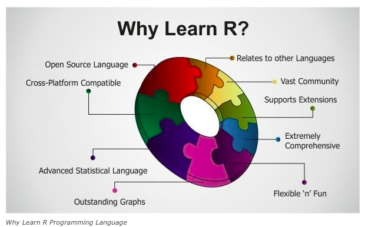
</center>

<<<<<<< HEAD
## What is R? (Ben)

- Object oriented programming language
  -Designed to make data handling and statitics intuitive.
 
- Why use it?
  - Intuitive, powerful, and popular.
  - Open source: it's free and maintained and upadated by programmers all over the world.
  
## There is a package for that!
<center>
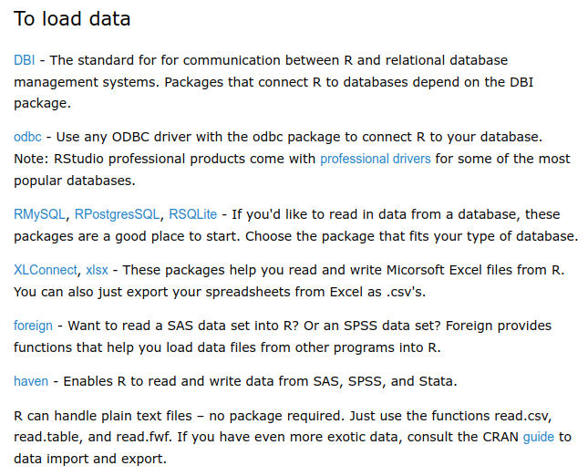
</center?

## There is a package for that!

<center>
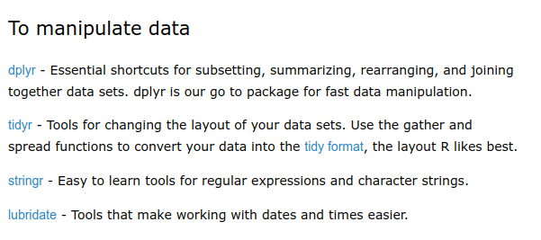
</center>
  
## There is a package for that!
<center>
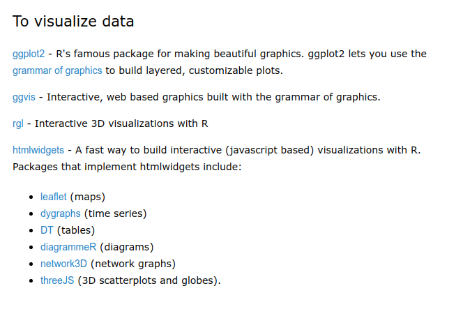  
</center>

## There is a package for that!

<center>
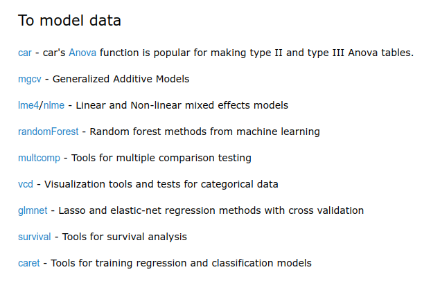
</center>
  
## There is a package for that!

<center>

</center>

## There is a package for that!

<center>
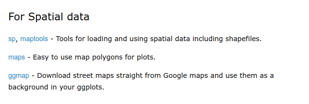
</center>

## There is a package for that!

<center>

</center>

## There is a package for that!

<center>
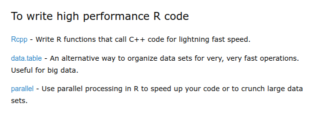
</center>

## There is a package for that!

<center>

</center>

## There is a package for that!

<center>

</center>


## R is fast 

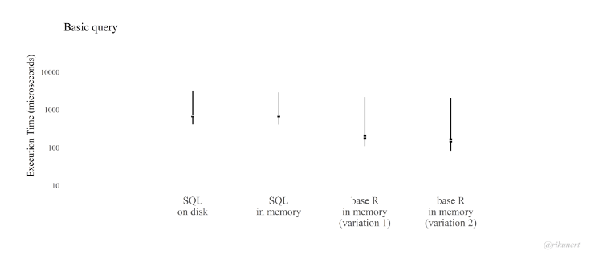

## R is beautiful

<center>
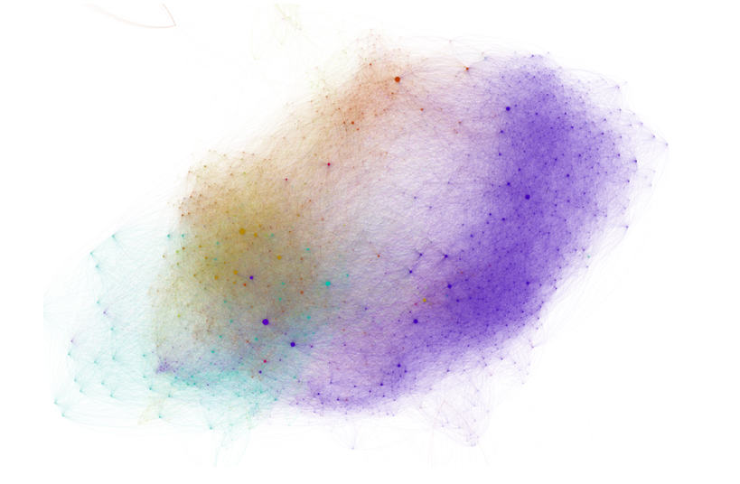
</center>


## R is beautiful

<center>

</center>


## R is beautiful
<center>
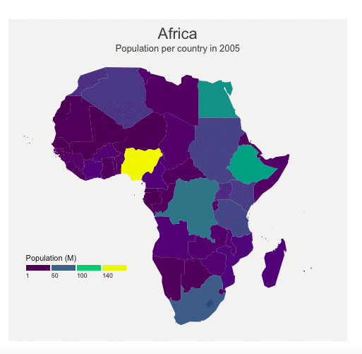
</center>

## R is beautiful
<center>

</center>


## R is beautiful
<center>
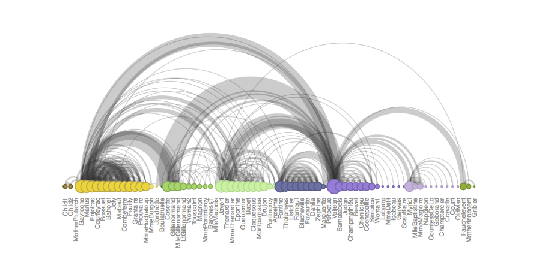
</center>


## The learning curve (Joe)

- Motivation
- Expectations
- Active, engaged learning 

## The learning curve (Joe)

```{r}
time <- 1:100
spss <- 1:100
sas <- ((1:100)^(2)) / 90
stata <- ((1:100)^(2.1)) / 100
excel <- ((1:100) ^ (0.2)) * 30
r <- ((1:100)^(2.3)) / 100
r[1:40] <- r[1:40] * seq(0, 1, length = 40)
pd <- tibble(time, excel, spss, sas, stata, r) %>%
  gather(key, value, excel:r) %>% 
  mutate(key = toupper(key))

variations <- list(
  c('EXCEL'),
  c('EXCEL', 'SPSS'),
  c('EXCEL', 'SPSS', 'SAS'),
  c('EXCEL', 'SPSS', 'SAS', 'STATA'),
  c('EXCEL', 'SPSS', 'SAS', 'STATA', 'R')
)
var_plot <- function(i){
  this_variation <- variations[[i]]
  pdx <- pd %>% filter(key %in% this_variation)
  ggplot(data = pdx,
       aes(x = time,
           y = value)) +
  geom_line(aes(color = key)) +
    scale_color_discrete(name = '') +
    labs(x = 'Time',
         y = 'Value of concepts learned')
}
var_plot(1)
```

## The learning curve (Joe)

```{r}
var_plot(2)
```

## The learning curve (Joe)

```{r}
var_plot(3)
```


## The learning curve (Joe)

```{r}
var_plot(4)
```


## The learning curve (Joe)

```{r}
var_plot(5) + xlim(1, 10) + ylim (0, 50)
```

## The learning curve (Joe)

```{r}
var_plot(5) 
```


## Preparing the environment (Arsenio)
- Installing R
- Installing RStudio
- Understanding the interface / the 4 panels
  - The scripts.
  - The console.
  - The global environment.
  - The plots.

## Preparing the environment|Installing R and RStudio

For this training, we will use:

1. **R** -- a free software environment for statistical computing and graphics (download and install from https://cloud.r-project.org/)
2. **RStudio** -- an integrated development environment for R (download and install from https://rstudio.com/products/rstudio/download/)
3. **Packages** -- extend the capabilities of R. To install a package, open RStudio then
   + Packages --> Install --> *type the package name in Packages* --> Install or
   + Type `install.packages("package_name")` then hit Enter key
     - e.g.: install.packages("plotly")

  
# Packages (Arsenio)
  
## Preparing the environment|Installing the necessary packages

Run the following code to install all the necessary packages

```{r, eval=FALSE}
npac <- c("ggplot2","plotly" , "dplyr", "tidyr", "mosaicData", "carData", "rio", "VIM", 
        "scales", "treemapify", "gapminder", "ggmap", "choroplethr", "choroplethrMaps", 
        "CGPfunctions", "ggcorrplot", "visreg", "gcookbook", "forcats", "survival", 
        "survminer", "ggalluvial", "ggridges", "GGally", "superheat", "waterfalls", 
        "factoextra", "networkD3", "ggthemes", "hrbrthemes", "ggpol", "ggbeeswarm",
        "knitr", "kableExtra")

install.packages(npac)
```

## How to use/load a package (Arsenio)

```{R, eval = FALSE}
library(dplyr)
library(ggplot2)
```


# Afternoon

## Preparing the data (Arsenio)

 - Exploring packages and functions to read in data.
 - Cleaning column names, removing missing values, and formatting variables. 
 - Preparing the data for analysis and visualization.

## Introduction to ggplot2 (Ben) 

- The advantages of ggplot.
- Quick, simple, and beautiful.
- Exploring the basics as well as showing the potential.

## The advantages 

<center>

</center>

## The advantages

- Its part of a pipeline of well maintained packages.
- Tidyverse = readr -> dplyr -> ggplot2

## Quck and simple 
<center>

</center>

## Quck and simple 
<center>

</center>


## Quck and simple 
<center>

</center>

## the potential
<center>
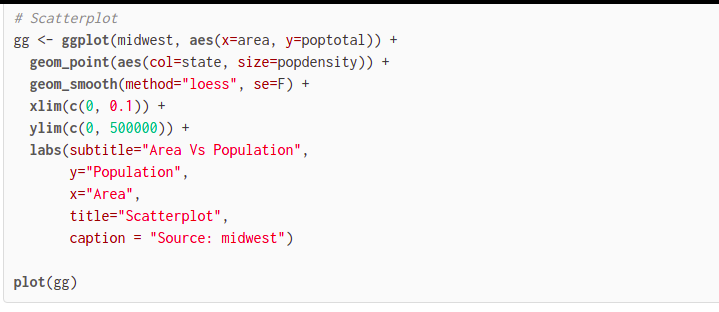
</center>

## the potential
<center>
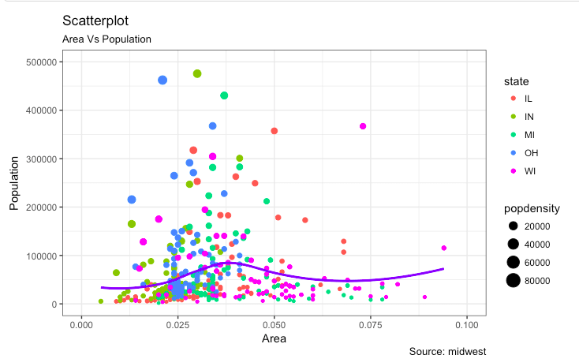
</center>


## the potential
<center>
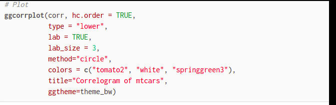
</center>

## the potential
<center>
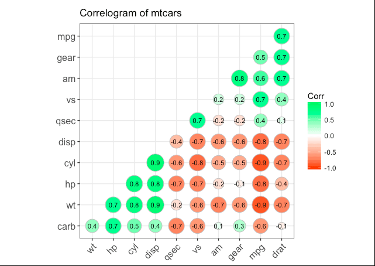
</center>

## the potential
<center>
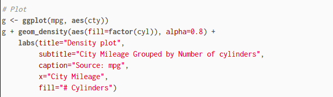
</center>

## the potential
<center>
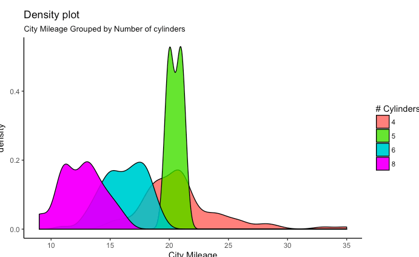
</center>

## the potential
<center>
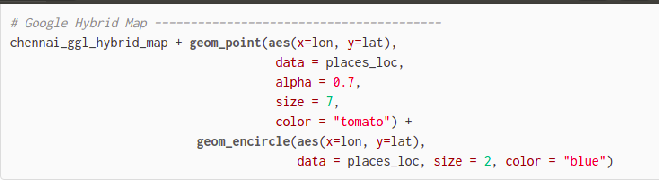
</center>

## the potential
<center>
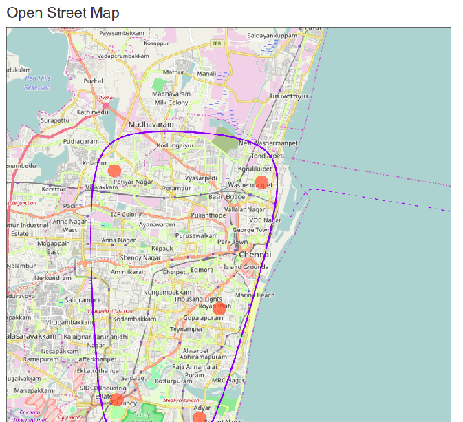
</center>


## First chart (Joe)

```{r}
library(gapminder)
```


## First chart (Joe)

```{r}
library(gapminder)
gm <- gapminder::gapminder
head(gm)
```


## First chart (Joe)

```{r}
library(gapminder)
gm <- gapminder::gapminder

ggplot(data = gm)
```

## First chart (Joe)

```{r}
library(gapminder)
gm <- gapminder::gapminder

ggplot(data = gm,
       aes(x = gdpPercap,
           y = lifeExp))
```

## First chart (Joe)

```{r}
library(gapminder)
gm <- gapminder::gapminder

ggplot(data = gm,
       aes(x = gdpPercap,
           y = lifeExp)) +
  geom_point()
```


# Preparing the data

## Preparing the data|Importing data from files (Arsenio)

Different packages/functions to import data from different file formats

<div style="float: left; width: 50%;">
```{r, eval=FALSE}
library(readr)
# from a comma delimited file
opd <- read_csv("opd.csv")
# from a tab delimited file
opd <- read_tsv("opd.txt")

library(readxl)
# from an Excel workbook
opd <- read_excel("opd.xlsx", sheet=1)
```
</div>


<div style="float: right; width: 50%;">
```{r, eval=FALSE}
library(haven)
# from Stata file
opd <- read_dta("opd.dta")
# from SPSS file
opd <- read_sav("opd.sav")
# from SAS file
opd <- read_sas("opd.sas7bdat")
```
</div>

## Preparing the data|Importing data from files (Arsenio)

Swiss-army knife for data import/export: `rio`
```{r, eval=FALSE}
library(rio)
# from any (supported) file format 
opd <- import("opd.csv") 
opd <- import("opd.txt")
opd <- import("opd.xlsx")
opd <- import("opd.dta")
opd <- import("opd.sav")
opd <- import("opd.sas7bdat")
```


## Preparing the data|Importing data from databases management systems (Arsenio)

Different packages for different DBMS, e.g.:

* RODBC --  implements ODBC, an API for accessing DBMS
* RMySQL/RMariaDB -- for accessing MySQL/MariaDB databases
* ROracle -- for accessing Oracle database
* RPostgreSQL -- for accessing PostgreSQL database
* RSQLite -- for accessing SQLite database
* RMongo -- for accessing MongoDB database
* ...

## Preparing the data|Importing data from databases management systems (Arsenio)

E.g.: Importing data from MariaDB

```{r, eval=FALSE}
library(RMariaDB)

con <- dbConnect(RMariaDB::MariaDB(), user = 'user_name', password  = 'password',
                 host = 'server_address', dbname = 'database_name')

death <- dbGetQuery(con,"SELECT d.person_id, m.date_birth, d.date_death, 
                    DATEDIFF(d.date_death,m.date_birth) AS age_days, 
                    d.place_death, d.place_death_other 
                    FROM dsdb.death AS d LEFT JOIN dsdb.resident AS m 
                    ON d.person_id=m.person_id 
                    WHERE YEAR(d.date_death) IN (2017, 2018) 
                    HAVING age_days BETWEEN 28 AND 1800")
```


## Preparing the data|Cleaning data (Arsenio)

* Often the most time-consuming part of any data analysis
* Some useful functions:


```{r,echo=FALSE}
Package <- c("dplyr", "dplyr", "dplyr", "dplyr", "dplyr", "tidyr", "tidyr")
Function <- c("select", "filter", "mutate", "summarize", "group_by", "gather", "spread")
Use <- c("select variables/columns",
         "select observations/rows",
         "transform or recode variables",
         "summarize data",
         "identify subgroups for further processing",
         "convert wide format dataset to long format",
         "convert long format dataset to wide format")

tibble(Package, Function, Use) %>% 
  kable() %>% 
  kable_styling(bootstrap_options = c('striped', 'hover', 'condensed'),full_width = TRUE,
                position = 'center')
```


## Preparing the data|Tranforming data (Joe)

(Interactive activity)

## Preparing the data|Tranforming data (Joe)

```{r}
gm <- gapminder::gapminder
```


## Preparing the data|Tranforming data (Joe)

- Create an object called `gmx`. This will be `gm`, but we will `filter` to include only the most recent year (2007).

```{r}
gm <- gapminder::gapminder
```


## Preparing the data|Tranforming data (Joe)

- Create an object called `gmx`. This will be `gm`, but we will `filter` to include only the most recent year (2007).

```{r}
gm <- gapminder::gapminder
gmx <- gm %>% filter(year == 2017)
```


## Preparing the data|Tranforming data (Joe)

- Create an object called `gmx`. This will be `gm`, but we will `filter` to include only the most recent year (2007).

```{r}
gm <- gapminder::gapminder
gmx <- gm %>% filter(year == 2007)
```

## Preparing the data|Tranforming data (Joe)

- Make an object called `ncountries`. To do this, group the data by continent and `tally` the number of countries

## Preparing the data|Tranforming data (Joe)

- Make an object called `ncountries`. To do this, group the data by continent and `tally` the number of countries

```{r}
ncountries <- gmx %>%
  group_by(continent) %>%
  tally
```

## Preparing the data|Tranforming data (Joe)

- Arrange `ncountries` from lowest to highest


## Preparing the data|Tranforming data (Joe)

- Arrange `ncountries` from lowest to highest

```{r}
ncountries <- gmx %>%
  group_by(continent) %>%
  tally
```


## Preparing the data|Tranforming data (Joe)

- Make a plot of the continents (x-axis) and the number of countries (y-axis)


## Preparing the data|Tranforming data (Joe)

- Make a plot of the continents (x-axis) and the number of countries (y-axis)

```{r}
ggplot(data = ncountries)
```


## Preparing the data|Tranforming data (Joe)

- Make a plot of the continents (x-axis) and the number of countries (y-axis)

```{r}
ggplot(data = ncountries,
       aes(x = continent,
           y = n))
```


## Preparing the data|Tranforming data (Joe)

- Make a plot of the continents (x-axis) and the number of countries (y-axis)

```{r}
ggplot(data = ncountries,
       aes(x = continent,
           y = n)) +
  geom_point()
```
